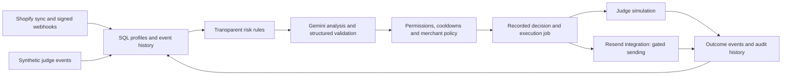

# Resolve

## Customer activity workspace

[Open Resolve](https://resolve-starnest-ai.vercel.app/demo). The workspace shares the landing page’s logo, navigation, typography, colors and theme controls. It shows actual Shopify test orders instead of the earlier fictional shopping journeys. The saved snapshot contains two test orders, six observed events, and a recorded Gemini operator-preview message based on the actual cancellation. Resend accepted that operator preview; inbox delivery is not independently verified.

A server-side reader can refresh test orders every 30 seconds without a database. It uses the existing `SHOPIFY_SHOP_DOMAIN`, `SHOPIFY_CLIENT_ID`, and `SHOPIFY_CLIENT_SECRET` values, is restricted to the authorized Resolve test store, and projects only non-identifying test-order fields. When the connection is absent or fails, the UI identifies its saved snapshot as **recorded**, never live. Names, contact details, addresses, access tokens, checkout URLs and private provider receipts are excluded.

Product browsing and cart capture are **not connected to this public workspace**, and automatic customer email is **off**. A draft and a test-preview acceptance are not proof of automatic customer delivery. See [the connection guide](https://resolve-starnest-ai.vercel.app/guide). Refresh the saved source with `node --experimental-strip-types scripts/refresh-store-activity.mjs`; the operator preview script is an explicit send operation, not part of page loading.

The older synthetic evidence files are retained as labelled historical test fixtures; they are not rendered by the current workspace. The historical audit below describes earlier runs, not the current live connection state.

## The problem and the approach

Businesses often see isolated signals: a failed payment, an incomplete checkout, a support problem, or declining usage. A generic reminder can miss the actual issue. Resolve connects the available evidence to a customer profile and makes its recommendation inspectable before execution.

1. **Collect:** synchronize Shopify customers and orders and receive signed commerce webhooks.
2. **Understand:** assemble the timeline and calculate a transparent priority score from unresolved events.
3. **Recommend:** ask Gemini for a possible cause, uncertainty, evidence references, an action category, and a message draft.
4. **Check:** validate the response and enforce communication permissions, merchant policy, cooldowns, and execution guards.
5. **Act and observe:** record the intervention and later events. The prepared judge walkthrough shows recorded test previews; the optional interactive sandbox simulates delivery and re-engagement. Production customer email requires additional configuration and verification.

The score is a **priority heuristic, not a churn probability**. A later purchase is an observed outcome, not proof that Resolve caused it.

## Earlier verification and current limits

These results were recorded on October 9, 2026. “Local” means the application ran on the development machine; “external” means an actual provider API was used.

| Capability | Evidence and current limit |
| --- | --- |
| Public website | Vercel landing page and `/demo` returned HTTP 200. Landing scenario and pause/resume controls worked. |
| Current activity workspace | Actual Shopify test orders and a recorded operator-preview response replace the earlier synthetic default. Live order reads are tested locally; hosted status must be checked through the connection badge. |
| Optional interactive sandbox | `/demo/ai` still uses `/api/judge`; the October 9 public audit returned HTTP 503. This storage-dependent workflow remains unverified on the hosted app. |
| Merchant access gates | Public `/dashboard`, `/api/agent`, and `/api/retention` returned HTTP 401 without authentication. This is a smoke check, not a complete security audit. |
| Shopify synchronization | Actual authorized development store: **5 customers, 2 orders, 0 abandoned checkouts** synchronized through the local application. Live abandoned-checkout recovery is not proved. |
| Gemini analysis | Actual `gemini-3.5-flash-lite` API: **5 of 6 synthetic evaluation contexts produced validated results**; the sixth was rejected for conflicting with communication policy. |
| Local judge journey | Real Gemini analysis, recorded approval, simulated delivery, simulated re-engagement, and history surviving reload. The checkout example’s score changed **45 → 0** after a synthetic completion event. |
| Automated verification | **58 test entries passed; 0 failed; 0 skipped** in the latest local pass. Tests include isolated SQL and controlled provider mocks. Type checking and local production builds passed. |
| Real customer email and revenue | **Not verified.** No live customer retention result or inbox delivery is claimed. |

The six-context Gemini evaluation measures category agreement and evidence references. The rule baseline selected the expected categories in all six contexts. This small evaluation does **not** establish superior AI accuracy, churn prediction, commercial uplift, or complete factual correctness of every generated sentence.

See [the submission audit](SUBMISSION_AUDIT.md) and [preserved verification evidence](hackathon-evidence/submission/) for timestamps, results, and remaining blockers.

## Open the workspace

Open [Customer activity](https://resolve-starnest-ai.vercel.app/demo) and scroll. No account or password is required. The source records are actual Shopify test orders, not invented browsing/cart sequences. A source log can be expanded. The cancellation has a recorded Gemini operator-preview message; acceptance by Resend is separate from confirmed inbox delivery and does not enable customer sending.

The status badge distinguishes recorded snapshots from successful live reads. When server-side Shopify credentials are configured, the page refreshes current test orders every 30 seconds. Without that connection, it preserves the timestamped saved records and clearly labels them as recorded. Detailed setup is in [the connection guide](https://resolve-starnest-ai.vercel.app/guide).

The optional `/demo/ai` sandbox is a separate synthetic test fixture with storage-dependent analysis and simulated outcomes. It is not the current activity workspace.

## Inspect the fictional data

The optional `/demo/ai` sandbox includes seven additional fictional cases. Every case shows a plain-language story, expected response, consent status, UTC timeline, and expandable profile/event JSON. Download [the complete dataset](public/demo-data.json); it contains only fictional people and `example.com` email addresses.

| Fictional case | What happened | Expected response |
| --- | --- | --- |
| Ava | Viewed Trail Shoes → cart → checkout → incomplete | Offer checkout help; stopping reason unknown |
| Leo | Browsed products without a checkout | Observe; no email |
| Maya | Completed the previously incomplete checkout | No recovery message |
| Oliver | Requested order cancellation | Offer support without inventing a reason |
| Noah | Incomplete checkout, email opted out | Internal review; no email |
| Emma | A previous message was simulated one hour ago | Wait; contact cooldown applies |
| Northstar | Fictional SaaS integration failures and falling usage | Technical troubleshooting |

Expected responses are inspectable rule-baseline expectations, **not cached Gemini answers**. Live analysis runs separately and must pass validation. Interactive demo timestamps are relative to session creation; the downloadable snapshot uses fixed UTC times. No real email is sent. The public [English guide](https://resolve-starnest-ai.vercel.app/guide) explains judge steps and actual Shopify setup separately.

## Architecture



| Layer | Implementation |
| --- | --- |
| Interface | React 19, Next.js 16, Tailwind, shadcn components |
| Local Cloudflare runtime | Vinext/Vite with a local D1 binding |
| Vercel runtime | Next.js with a server-side D1 HTTP adapter |
| Persistence | D1-compatible SQL and versioned migrations; profiles, events, decisions, actions, jobs, and judge sessions |
| AI | Gemini REST API, structured JSON, Zod validation, known-evidence checks, and policy validation |
| Commerce | Shopify Admin GraphQL, OAuth implementation, signed webhook ingestion |
| Messaging | Resend integration and signed delivery-receipt handling; real customer sending is not verified |

`/api/judge` is the public, session-scoped simulation API. Merchant APIs require authentication outside local development. Separate environment adapters allow the same application logic to use a Cloudflare binding locally or managed D1 from Vercel.

## Run locally

**Prerequisites:** Git, Node.js 22.18 or newer, npm, and the ability to run Wrangler locally. Gemini is optional for the labelled fallback demonstration. Shopify and Resend credentials are not required for the synthetic judge journey.

```sh
git clone https://github.com/Zarifa197/resolve-starnest-ai.git
cd resolve-starnest-ai
npm ci
npm run build
```

For a **new, empty local database**, apply the seven committed migrations in numeric order:

```sh
for migration in \
  drizzle/0000_unique_paibok.sql \
  drizzle/0001_confused_captain_cross.sql \
  drizzle/0002_open_expediter.sql \
  drizzle/0003_retention_workflow.sql \
  drizzle/0004_shopify_agent.sql \
  drizzle/0005_judge_sessions.sql \
  drizzle/0006_pixel_collectors.sql
do
  npx wrangler d1 execute DB --local \
    --config dist/server/wrangler.json --file "$migration"
done
```

Do not rerun the base migrations against a populated database. Back up existing data and apply only migrations that are missing. Migration `0006` adds the optional anonymous pixel collector and its quotas.

Create an ignored `.dev.vars` file if using Gemini:

```dotenv
GEMINI_API_KEY=your_private_gemini_key
```

Then start the application:

```sh
npm run dev
```

Open the address printed by the server, normally `http://127.0.0.1:5173/demo`. The local development bypass is for loopback development only; do not expose that development server as merchant production hosting.

## Vercel configuration and the current storage blocker

Import this repository with root directory `./` and framework preset **Next.js**. Use:

| Setting | Value |
| --- | --- |
| Install command | `npm ci` |
| Build command | `npm run build:vercel` |
| Output directory | `.next-vercel` |
| Runtime selector | `RESOLVE_RUNTIME=vercel` |

The build emits `.next-vercel`; an output-directory mismatch can make a successful Next.js build fail deployment. Use the Vercel project’s output setting if its configuration does not already specify that directory.

Vercel functions require **managed storage**. The laptop’s `.wrangler` SQLite files are not durable Vercel storage. Create a dedicated Cloudflare D1 database and apply migrations `0000` through `0006` above to that database once, in numeric order. For authenticated Wrangler, use `--remote` and the actual managed database’s configuration/name instead of the local command above.

Save these variables in **Vercel → Project → Environment Variables → Production**:

| Variable | Required for | Description |
| --- | --- | --- |
| `RESOLVE_RUNTIME` | Vercel runtime | Set to `vercel`. |
| `CLOUDFLARE_ACCOUNT_ID` | Persistent judge demo | Cloudflare account containing the database. |
| `D1_DATABASE_ID` | Persistent judge demo | Managed D1 database UUID. |
| `CLOUDFLARE_D1_TOKEN` | Persistent judge demo | Account-scoped D1 API credential. |
| `GEMINI_API_KEY` | Actual AI analysis | Server-side Gemini key; otherwise use the labelled fallback. |

After updating runtime variables, redeploy and test `/demo/ai` in a fresh browser session. The current 503 can result from absent/invalid database configuration, inaccessible D1, or unapplied schema. Its exact cause requires server logs; the public error alone does not identify it.

Merchant workflows additionally use `PUBLIC_APP_URL`, `SESSION_SECRET`, `SHOPIFY_CLIENT_ID`, `SHOPIFY_CLIENT_SECRET`, `SHOPIFY_SHOP_DOMAIN`, and `CRON_SECRET`. Restricted email testing uses `RESEND_API_KEY` and `EMAIL_TEST_TO`; receipt verification uses `RESEND_WEBHOOK_SECRET`. See [DEPLOYMENT.md](DEPLOYMENT.md) and the environment declarations before enabling optional integrations.

**Never put secrets in `NEXT_PUBLIC_*`, the README, screenshots, or Git history.** A verified sender, explicit merchant configuration, and communication eligibility are required before enabling real-customer sending. The committed Vercel cron is daily at 00:00 UTC; it does not provide rapid recovery scheduling.

## Verify the implementation

```sh
npm test
npm run typecheck
npm run build:vercel
npm run build
```

The automated suite covers retention rules, execution guards, judge-session isolation, webhook verification, OAuth checks, and the D1 adapter, using mocks where external services would otherwise be called. A passing suite or build does not prove hosted database connectivity, delivery, or revenue recovery.

The model evaluation script is `scripts/evaluate-gemini.mjs`. It calls the actual Gemini API when configured and can consume API quota. Read its configuration requirements before running it. Existing provider evidence is preserved; failures are not removed from the reported denominator.

## Code map

| Path | Purpose |
| --- | --- |
| `app/page.tsx`, `app/landing.css` | Public product presentation |
| `app/demo/page.tsx`, `app/api/judge/route.ts` | Isolated judge demonstration |
| `components/resolve/retention.tsx` | Timeline, diagnosis, action, and outcome interface |
| `lib/retention-core.ts` | Scoring, schemas, and validation |
| `lib/retention-gemini.ts` | Model request, evidence aliases, and structured analysis |
| `lib/retention-store.ts`, `lib/retention-jobs.ts` | Persistence and intervention workflow |
| `lib/shopify-client.ts`, `lib/shopify-intelligence.ts` | Shopify synchronization and commerce signals |
| `lib/merchant-auth.ts`, `lib/merchant-policy.ts` | Authentication and execution policy |
| `build/node-runtime.ts`, `lib/d1-http.ts` | Vercel-to-D1 storage adapter |
| `drizzle/`, `tests/` | Database migrations and automated verification |
| `extensions/resolve-pixel/`, `lib/pixel-collector.ts` | Anonymous storefront collection; not verified live |

## Boundaries and unfinished work

- The hosted judge workflow needs storage repair and a complete public retest.
- Shopify browsing capture is experimental and **not verified live**. Visiting a product and leaving is not established evidence of dissatisfaction.
- Real Resend inbox delivery, production OAuth, and unattended hosted job execution remain unverified.
- Production customer sending remains disabled pending configuration and live verification. The optional interactive sandbox simulates delivery; the prepared walkthrough records real restricted test-preview acceptance without claiming inbox delivery.
- No learned churn model, return-time prediction, proven retention uplift, or closed-loop model learning is claimed.
- Non-Shopify scenarios are synthetic examples; they do not establish production integrations with CRM, billing, or other SaaS providers.
- Draft editing, inbound replies, complete privacy-erasure workflows, and operational cleanup require further work.
- HTML motion/storyboard files in the local workspace are presentation assets, not evidence of runtime behavior or an exported After Effects video.

## Hackathon submission and attribution

The submission claim supported by current evidence is: **“Resolve connects Shopify customer events to an inspectable AI retention workflow; the local demonstration uses real Gemini and records simulated interventions and outcomes.”** The website is deployed, but the hosted workflow is not yet fully operational.

Codex assisted implementation and verification. The project reuses a Sites/Vinext scaffold, shadcn components, and the libraries listed in `package.json`; retained vendor notices are in `vendor/` and `build/`. Whisperr.net was supplied as a landing-page visual reference. Resolve does not claim authorship of that reference site.

Commit timestamps alone do not establish when every feature was built. Consult [PROVENANCE.md](PROVENANCE.md) and the organizers’ rules before declaring eligibility. Earlier [HACKATHON.md](HACKATHON.md) and [IMPLEMENTATION.md](IMPLEMENTATION.md) preserve historical states; use the dated submission audit for this verification pass.

This README makes the project understandable and reproducible for human judges and automated screening. Passing an unspecified screening rubric is not guaranteed; documentation does not substitute for required submission fields, disclosures, or a functioning demo.

### Real owner trial enrollment

The workspace includes an explicitly enrolled owner test participant, persisted locally in `test_participants`, with the registration email reservation and acceptance stored in `test_participant_messages`. The owner’s existing #1002 test purchase was matched by its exact checkout email; #1001 belongs to another customer and is not attributed to the owner. The public projection exposes IDs, the registration message and status, while withholding email and provider identifiers. This is recorded local database evidence, not a live Vercel database or an automatic recovery-email claim.

`node scripts/register-test-participant.mjs` registers the configured `EMAIL_TEST_TO` address and sends at most one registration confirmation. Re-running reconciles available provider receipts without resending. Then `node --experimental-strip-types scripts/refresh-store-activity.mjs` reads actual Shopify orders. `EMAIL_TEST_TO` is required server-side on Vercel to match new test orders to this enrolled participant; it must never be public.
