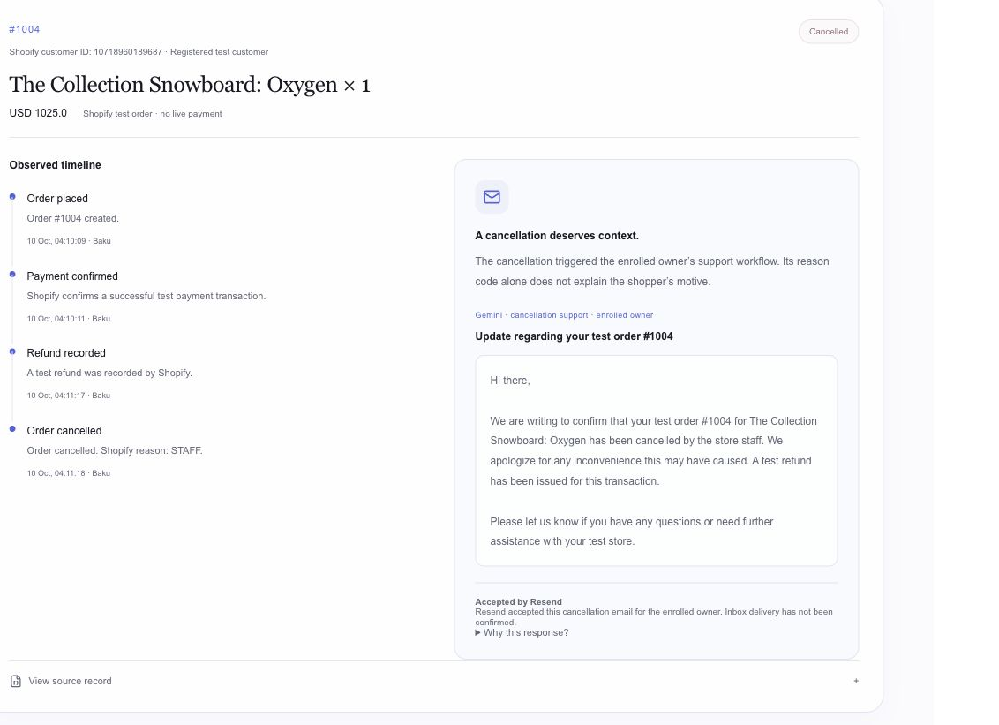
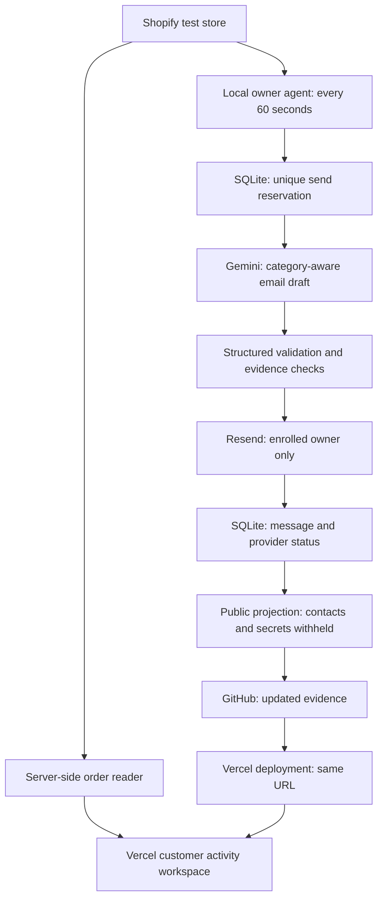

# Resolve

### The right support email starts with the right context.

Resolve connects Shopify order activity to an AI support workflow: observe what happened, understand the recorded cancellation category, generate a relevant email with Gemini, and preserve the message and provider status in an inspectable workspace.

**Planned expansion: behavior-based retention.** Resolve will also use Shopify browsing, cart, and checkout activity to identify possible friction or dissatisfaction, help Gemini understand the available context, and send a relevant support email to an identified customer under the merchant's outreach policy. These behavior-based triggers are planned; the verified automatic email flow today starts with order cancellations.

**The working MVP uses real Shopify test orders, real Gemini generation, and real Resend API requests.** Its automatic sender is restricted to an explicitly enrolled owner testing their own store. It is an early retention product, not a claim of proven revenue recovery.

[**Open the live workspace →**](https://resolve-starnest-ai.vercel.app/demo) · [Product website](https://resolve-starnest-ai.vercel.app/) · [Connection guide](https://resolve-starnest-ai.vercel.app/guide)

**No account or password is needed to inspect the public workspace.** Opening it does not place orders or send emails.



*Actual workspace capture, October 10, 2026. The order used Shopify's test gateway; no live payment was charged.*

## Why Resolve exists

A customer asking to cancel, an inventory problem, and a staff mistake deserve different responses. A generic “come back” email can ignore the issue or blame the wrong person.

Resolve's approach is to connect **evidence → context → assistance**, with a record of what the system knew and what it did. The current working entry point is order cancellation. Browsing and cart abandonment are future integration work; they are not presented as captured activity.

For example:

- **Customer cancellation:** confirm the cancellation and ask whether help is needed, without guessing the customer's motive.
- **Staff cancellation:** acknowledge the store's cancellation, apologize for inconvenience, and offer assistance.
- **Inventory cancellation:** acknowledge the recorded availability issue without inventing a restock date.

A cancellation category is useful context. It does not prove dissatisfaction, churn, or the detailed reason behind a decision.

## Explore the demo in one minute

1. Open [the workspace](https://resolve-starnest-ai.vercel.app/demo). No installation or login is required.
2. Find **#1004 — The Collection Snowboard: Oxygen**. Its timeline shows the actual order, successful test payment, refund, and `STAFF` cancellation.
3. Read the email beside the timeline. It acknowledges a cancellation by the store, rather than implying the shopper requested it.
4. Expand **Why this response?** for the explanation, uncertainty, and referenced events. Expand **View source record** to inspect the Shopify projection.
5. Compare **#1003 — Selling Plans Ski Wax**, cancelled with `CUSTOMER`. Its email asks whether a problem occurred and offers help.

**Connected to Shopify** means a successful live order read. **Recorded Shopify activity** means a timestamped saved snapshot. The page refreshes orders every 30 seconds while visible and retains the last confirmed records if a read fails.

The email label distinguishes **accepted by Resend** from **delivery reported by Resend**. Acceptance is a real provider response, but does not by itself establish inbox placement or that the customer read the email.

## What is working today

Evidence snapshot: **October 10, 2026, Asia/Baku**. Counts may change as the owner creates new test orders.

| Capability | Current evidence |
| --- | --- |
| Public product and workspace | Deployed on Vercel at the links above; landing page and workspace share the Resolve design and navigation. |
| Live Shopify order reads | Server-side Admin GraphQL reader, restricted to the authorized test store; the live connection was verified on the deployed workspace. |
| Actual activity history | Saved snapshot: **4 test orders and 14 observed events**, including creation, successful test payment, cancellation, and refund. |
| Customer matching | Explicitly enrolled owner profile; orders are matched using the exact private checkout email. Public records expose references, not contact details. |
| Gemini support emails | Actual generation from the matched order's product, event history, and cancellation category. |
| Real sending | **2 owner cancellation emails accepted by Resend:** #1003 (`CUSTOMER`) and #1004 (`STAFF`). Registration messages and operator previews are excluded from this count. |
| Duplicate protection | A persistent reservation before generation/sending, one cancellation message per order, and a stable provider idempotency key. |
| Inspectability | Timeline, generated content, explanation, uncertainty, provider status, and downloadable source projection. |
| Category coverage | All six cancellation categories are enabled for the enrolled owner trial. CUSTOMER and STAFF have actual acceptance receipts; the remaining categories have controlled provider tests. |
| Automated verification | **69 test entries passed, 0 failed, 0 skipped** in the latest full local suite. Type checking and the Vercel production build also passed during this iteration. |

The older **#1001 operator preview** is labelled separately and belongs to a different test customer. It is not counted as an owner cancellation email. Historical synthetic fixtures remain in the repository for development; the current `/demo` workspace displays actual store records.

## From Shopify event to email

1. **Observe:** read actual test orders and successful test transactions from Shopify. A processed timestamp alone is not treated as proof of payment.
2. **Match:** require the named test store, the enrolled owner's exact checkout email, a real Shopify customer ID, and a cancellation after enrollment.
3. **Reserve:** insert a unique `owner_recovery_messages` record before calling Gemini or Resend.
4. **Generate:** send Gemini the order reference, product, observed events, category-specific guidance, and known uncertainties.
5. **Validate:** require structured fields and known event references; reject unsupported links, email addresses, discount/urgency language, and invalid subject formatting.
6. **Send:** submit the validated email only to the configured, enrolled test address through Resend.
7. **Record:** persist the draft and provider acceptance, rejection, or uncertainty. A replay or timeout does not silently trigger another send.
8. **Publish:** export only the allowed public fields. The owner's local agent can push updated records to GitHub, triggering Vercel deployment to the same public URL.

The automatic agent polls every **60 seconds**, independently of workspace visits. Email evidence appears on the hosted workspace after the updated record is published and deployed; it does not arrive through a direct shared cloud database.

### Cancellation categories

| Shopify category | Response guidance |
| --- | --- |
| `CUSTOMER` | Confirm cancellation, ask whether a problem occurred, offer help. |
| `STAFF` | Acknowledge a store/staff cancellation, apologize, offer clarification. |
| `INVENTORY` | Explain the recorded availability issue; do not promise restocking or alternatives. |
| `DECLINED` | Offer payment/checkout support; do not request card details or invent a bank's reason. |
| `FRAUD` | Use neutral security-check language; never accuse the shopper or request sensitive identity/payment details. |
| `OTHER` | Confirm cancellation and offer clarification; do not invent a cause. |

Category definitions follow [Shopify's OrderCancelReason documentation](https://shopify.dev/docs/api/admin-graphql/latest/enums/OrderCancelReason). Unknown categories are excluded. This coverage applies to the owner test trial, not unrestricted outreach to every merchant's customers.

## Architecture and runtime boundaries



| Component | Implementation |
| --- | --- |
| Interface | React 19, Next.js 16, Tailwind, shadcn components, Lucide icons. |
| Commerce | Shopify Admin GraphQL; the repository also contains OAuth, synchronization, and signed webhook code. |
| AI | Gemini REST API; the verified owner trial uses `gemini-3.5-flash-lite`. |
| Email | Resend API with a stable idempotency key and separate acceptance/delivery states. |
| Owner-trial persistence | Local SQLite in Wrangler's D1 state, with versioned SQL migrations. |
| Hosting | Vercel serves the website, live order-reader endpoint, and published evidence. |
| Optional storage-backed workflows | Cloudflare/Vinext local D1 binding and a Vercel-to-D1 HTTP adapter; these require separate managed database configuration. |

**The owner sender runs on the operator's computer.** Keep that computer and process running to handle new cancellations. Existing published records remain visible after it stops. This is not an always-on Vercel email worker or a fully deployed multi-merchant service.

## Run the public workspace locally

Use **Node.js 22.18+**, npm, and Git.

```sh
git clone https://github.com/Zarifa197/resolve-starnest-ai.git
cd resolve-starnest-ai
npm ci
npm run dev:vercel
```

Open the address printed by Next.js, normally `http://localhost:3000/demo`. No credentials are required to inspect the committed Shopify snapshots and recorded email content. Those records are historical evidence; this command does not recreate the store or send a new email.

For live reads on an authorized checkout, add server-only values to an ignored `.env.local` file:

```dotenv
RESOLVE_RUNTIME=vercel
SHOPIFY_SHOP_DOMAIN=resolve-test-xsmzpr1z.myshopify.com
SHOPIFY_CLIENT_ID=your_shopify_client_id
SHOPIFY_CLIENT_SECRET=your_private_shopify_client_secret
EMAIL_TEST_TO=the_explicitly_enrolled_owner_address
```

The current reader and owner agent deliberately allow only the project's named test store. They are not a turnkey integration for an arbitrary Shopify merchant. Enrollment and credentials must belong to the authorized owner; do not substitute unrelated customer information.

### Run the real owner-trial agent

This section is for authorized maintainers of the test store. It requires the existing local D1/SQLite database, an enrolled participant, Shopify access, Gemini access, and a Resend test recipient compatible with the configured sender.

For a **new empty local database**, build the Cloudflare target and apply all nine migrations in numeric order:

```sh
npm run build
for migration in drizzle/000*.sql; do
  npx wrangler d1 execute DB --local \
    --config dist/server/wrangler.json --file "$migration"
done
```

For an existing database, back it up and apply only missing migrations. Do not rerun the base schema blindly.

The owner scripts read an ignored `.dev.vars` file containing `SHOPIFY_SHOP_DOMAIN`, `SHOPIFY_CLIENT_ID`, `SHOPIFY_CLIENT_SECRET`, `GEMINI_API_KEY`, `RESEND_API_KEY`, and `EMAIL_TEST_TO`.

```sh
# Enrollment sends at most one registration confirmation to the configured owner.
node scripts/register-test-participant.mjs

# Read actual matching test orders and save the public projection.
node --experimental-strip-types scripts/refresh-store-activity.mjs

# Automatic processing; may send eligible owner cancellation emails.
node --experimental-strip-types scripts/run-owner-recovery.mjs --watch
```

For the existing owner's authorized GitHub/Vercel workflow, add `--publish` to the last command. It pushes only the activity/email projections, preserving unrelated repository changes. Publication requires configured Git access and triggers a deployment when the saved message/status changes.

Never put keys, contact addresses, raw private provider receipts, `.dev.vars`, `.env.local`, or SQLite files in Git. The public projection deliberately withholds those fields.

## Deploy on Vercel

Import the repository with root directory `./` and framework preset **Next.js**.

| Setting | Value |
| --- | --- |
| Install command | `npm ci` |
| Build command | `npm run build:vercel` |
| Output directory | `.next-vercel` — matches `next.config.ts`. |
| Runtime variable | `RESOLVE_RUNTIME=vercel` |

Add the server-side Shopify values above to **Production** for live order reads, then redeploy. Without them, the workspace keeps its labelled recorded snapshot. The public reader does not require a hosted SQL database.

The optional storage-backed merchant/sandbox workflows additionally require `CLOUDFLARE_ACCOUNT_ID`, `D1_DATABASE_ID`, `CLOUDFLARE_D1_TOKEN`, and the applied SQL schema. A local SQLite file is not durable Vercel storage. See [deployment notes](DEPLOYMENT.md) for those workflows; their older audit state is separate from the currently verified activity workspace.

The committed daily Vercel cron is not the owner's 60-second sender. Moving the trial to hosted automation requires durable storage, a deployed worker/scheduler, delivery-receipt verification, and production communication policy.

## Verification

```sh
npm test
npm run typecheck
npm run build:vercel
```

The latest full suite passed **69 test entries**, including owner matching, category routing, duplicate reservations, changed-order replays, send timeouts, rejected drafts, provider-status integrity, retention rules, session isolation, OAuth/webhook checks, and the D1 adapter. External providers are mocked in unit tests; they are not 69 live email sends.

The actual #1003 and #1004 trial records provide the separate Shopify/Gemini/Resend evidence. [Source activity](public/store-activity.json) and [owner email records](public/owner-recovery.json) are inspectable JSON projections. Earlier evaluation results and logs are preserved in [the submission audit](SUBMISSION_AUDIT.md) and [evidence directory](hackathon-evidence/submission/); historical synthetic outcomes are not evidence of actual customer recovery.

## Planned: support based on shopper behavior

The next integration extends the same **observe → understand → email → log** workflow to the shopping journey:

| Planned signal | Intended response |
| --- | --- |
| A known shopper views products and leaves without buying | A helpful product question or offer of assistance, using the products actually viewed. |
| A shopper adds products to the cart and leaves | A cart-specific email asking whether they need help with those items. |
| A shopper starts checkout but does not complete it | A checkout-specific support email based on any recorded friction, without inventing a payment failure. |

Gemini will distinguish observed behavior from an inferred cause. Leaving a store alone does not prove dissatisfaction; when the reason is unclear, the message should ask rather than assume. Outreach requires a linked customer email and applicable consent and merchant policy. Anonymous browsing cannot produce an identifiable email recipient by itself.

Each eligible intervention will keep the triggering events, Gemini's explanation, the email content, and the provider status visible in the workspace. This integration is **planned, not yet verified in the live demo**; it requires storefront collection, identity linking, durable storage, and a hosted processor.

## What is not connected yet

- **Browsing and cart abandonment:** collector code exists, but its storefront deployment, identity linking, durable collection, and automatic outreach are not verified in the public workspace.
- **General customer sending:** the current automatic sender is restricted to the consenting owner and actual test orders. Production sender/domain configuration and broader merchant policy still need verification.
- **Hosted unattended email processing:** the current owner agent is local; managed storage and a hosted scheduler remain necessary.
- **Retention measurement:** no recovered revenue, causal uplift, learned churn model, or customer-read proof is claimed.
- **Inbound customer replies:** automatic reply ingestion and cause confirmation are not part of the verified workflow.

The optional `/demo/ai` route contains synthetic development scenarios and a storage-dependent simulation. Its hosted behavior is not established by the current live-order demo. The repository's broader retention engine includes rules, policies, jobs, and simulated outcomes; these are separate from the verified owner trial described above.

## Repository guide

| Path | Purpose |
| --- | --- |
| `app/page.tsx`, `app/landing.css` | Product website. |
| `app/demo/page.tsx`, `components/resolve/store-activity.tsx` | Current public activity workspace. |
| `app/api/public/activity/route.ts`, `lib/store-activity.ts` | Restricted live Shopify reader and public projection. |
| `lib/owner-cancellation.mjs`, `scripts/run-owner-recovery.mjs` | Category-aware owner email generation, sending, deduplication, and publication. |
| `components/resolve/owner-response.tsx` | Email content, status, explanation, and evidence display. |
| `scripts/register-test-participant.mjs`, `public/test-participant.json` | Owner enrollment and allowed public registration projection. |
| `drizzle/0007_test_participant.sql`, `drizzle/0008_owner_recovery.sql` | Enrollment and email reservation/receipt tables. |
| `lib/retention-core.ts`, `lib/retention-gemini.ts`, `lib/retention-jobs.ts` | Broader retention rules, analysis, and execution pipeline. |
| `extensions/resolve-pixel/`, `lib/pixel-collector.ts` | Storefront collection implementation; not connected to the verified public flow. |
| `tests/`, `hackathon-evidence/` | Automated checks and preserved historical evidence. |

## Development and attribution

Built by **Zarifa Ilyasova**. Codex assisted implementation and verification. The project reuses a Sites/Vinext scaffold, shadcn components, and the dependencies recorded in `package.json` and the lockfile. Whisperr.net was a visual reference for the landing page; Resolve does not claim authorship of that reference site. Dependency/vendor notices are retained in `vendor/` and `build/`.

See [PROVENANCE.md](PROVENANCE.md) for the recorded development history, reused material, and competition-eligibility boundaries. This README describes the October 10 implementation; older audits and submission documents preserve their own dated states.

**Current demonstrated claim:** Resolve turns actual Shopify test-order cancellations into category-aware Gemini support emails for an enrolled owner, with persistent send reservations and inspectable provider acceptance records on a deployed website.
