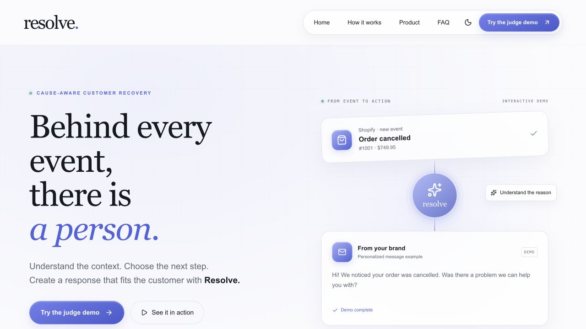
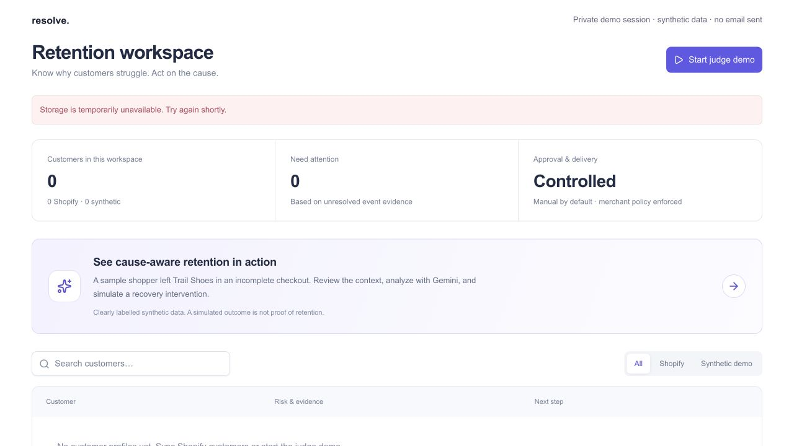
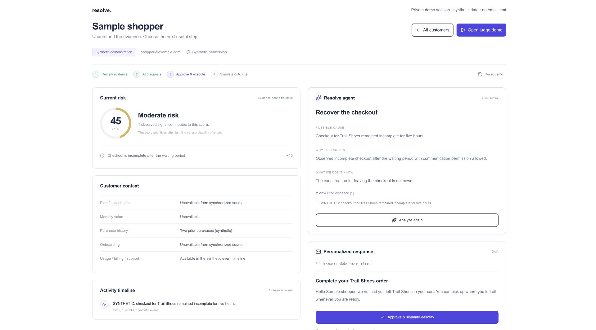

# Resolve — final submission verification

Audit date: **October 9, 2026**. Public HTTP evidence: **19:32 Baku / 15:32 UTC**. Earlier local and provider verification: approximately **18:26–18:51 Baku**.

Target: https://resolve-starnest-ai.vercel.app/

## Verdict

**The website is publicly deployed. The hosted judge workflow is not submission-ready.** The landing page renders and its interactive controls respond, but starting the judge demo displays a storage error. A functional local demonstration, real Shopify development-store queries, real Gemini calls, and passing automated tests are evidenced separately.

No real customer email, payment, or merchant data mutation was performed in this public audit. Public requests used normal TLS verification and no authentication. The exact deployed commit was not established from the public site.

## Public deployment checks

| Check | Result | Interpretation |
| --- | --- | --- |
| `/` | HTTP 200 | Landing page delivered by Vercel; meaningful content rendered. |
| `/demo` | HTTP 200 | Judge interface renders; HTML availability alone does not pass its workflow. |
| Start judge demo | Visible storage error | **Fail:** judges cannot start the end-to-end hosted journey. |
| `/api/judge` | HTTP 503 | Persistent storage unavailable; exact cause needs server logs. |
| `/dashboard` | HTTP 401 | Unauthenticated merchant access rejected. |
| `/api/agent` | HTTP 401 | Unauthenticated access rejected. |
| `/api/retention` | HTTP 401 | Unauthenticated access rejected. |
| `/api/cron` | HTTP 401 | Anonymous scheduler request rejected. |
| Landing scenario control | Content changed to payment-failure illustration | Interaction works; illustration is not evidence of a live Stripe integration. |
| Landing pause/resume | Control changed to Resume | Interaction works. |
| Mobile landing at 390 × 844 | Document width 390 | No horizontal overflow observed in this viewport. |

Evidence: [public HTTP results](hackathon-evidence/submission/public-http-checks.json), [public landing](hackathon-evidence/submission/01-public-landing.jpg), [public demo error](hackathon-evidence/submission/02-public-demo-storage-error.jpg), [mobile viewport](hackathon-evidence/submission/03-public-mobile.jpg).

No error/warning console entries were captured on the demo page. This does not override the visible application failure. Request timings are single samples, not a performance benchmark or uptime guarantee.

## Local and external evidence

| Verification | Result | Limits |
| --- | --- | --- |
| Automated tests | 46 test entries passed, 0 failed, 0 skipped | Isolated SQL and controlled provider mocks; not production proof. |
| Type checking | Passed | Static validation. |
| Vercel and Cloudflare builds | Passed locally | Does not establish hosted runtime configuration. |
| Actual Shopify sync | 5 customers, 2 orders, 0 checkouts | Authorized development shop; zero records cannot prove live checkout recovery. |
| Actual Gemini evaluation | 5 validated responses across 6 synthetic contexts | Sixth rejected for communication-policy conflict. Five successful responses had category agreement and valid evidence references. |
| Rule baseline | Expected categories in all six evaluation contexts | No demonstrated AI category-selection advantage. |
| Local checkout journey | Real Gemini → approval → simulated delivery → synthetic completion → reload | Priority score 45 → 0; no real email, sale, or measured retention. |
| Local SaaS journey | Synthetic Northstar profile, real Gemini, recorded simulation and outcome | Priority score 90 → 0 after synthetic recovery events; no live CRM integration. |
| Local session checks | Two independent workspaces; cross-session action rejected; foreign-origin action rejected; reset isolated | Must be repeated on the hosted site after storage repair. |

Evidence: [tests](hackathon-evidence/submission/automated-tests.txt), [type check](hackathon-evidence/submission/typecheck.txt), [Vercel build](hackathon-evidence/submission/vercel-build.txt), [Cloudflare build](hackathon-evidence/submission/cloudflare-build.txt), [Shopify sync](hackathon-evidence/submission/shopify-sync.json), [Gemini evaluation](hackathon-evidence/submission/gemini-evaluation.json), [local browser journeys](hackathon-evidence/submission/local-browser-journeys.json), [local session checks](hackathon-evidence/submission/local-judge-api-checks.json).

A [read-only local persistence snapshot](hackathon-evidence/submission/local-demo-persistence.json), captured at 19:47 Baku, confirms saved Gemini decisions, simulated actions, and synthetic recovery events for the two demonstrated profiles. The browser-journey JSON contains initial API snapshots and recorded browser observations; its empty initial decision arrays are not evidence of final analysis. The persistence snapshot and screenshots provide that separate evidence.

The model evaluation checks categories and references, not every sentence’s truthfulness. In particular, structural validation is not a complete semantic fact checker. Do not label 5/6 as churn accuracy or measured retention effectiveness.

## Required repair before sharing the demo as working

1. Configure a dedicated managed Cloudflare D1 database for Vercel. Set `CLOUDFLARE_ACCOUNT_ID`, `D1_DATABASE_ID`, and `CLOUDFLARE_D1_TOKEN` in Production. Never expose these credentials publicly.
2. Apply the committed SQL migrations `0000` through `0005` to a new database in order, or only missing migrations to an existing database. Verify the selected database ID and token access.
3. Set `RESOLVE_RUNTIME=vercel` and, for actual AI analysis, `GEMINI_API_KEY`. Keep the build output setting `.next-vercel`.
4. Redeploy after environment changes and inspect server logs if the error remains. The public 503 does not prove which configuration element is wrong.
5. In a fresh browser context, complete Start → Analyze → Simulate delivery → Simulate re-engagement → Reload. Confirm seven synthetic profiles, persisted history, and truthful engine labels.
6. Repeat with a second session and confirm isolation. Confirm merchant APIs remain protected and public simulation never calls Resend.
7. Update the availability notice and audit with fresh timestamps only after those checks pass.

The synthetic guest session is already implemented; a shared username/password is unnecessary and would not repair storage. See [JUDGE_GUIDE.md](JUDGE_GUIDE.md).

## Remaining limitations

- Public persistent storage is currently failing; hosted Gemini, persistence, and outcomes were not exercised beyond that blocker.
- Shopify pixel/browsing capture is not verified live. Browsing alone is not proof of dissatisfaction.
- Production OAuth, actual inbox delivery, hosted background execution, and commercial outcomes remain unverified.
- The daily Vercel cron is insufficient for prompt recovery.
- The Northstar shortcut selected the wrong local profile; its customer-list row works.
- Return-time prediction, learned churn probabilities, proven uplift, and model learning are not implemented claims.
- Complete privacy-erasure workflows, inbound replies, and draft editing remain incomplete.

## Hackathon screening readiness

The README now explains the problem, implemented workflow, architecture, local setup, environment names, judge access, reproducible checks, evidence, limitations, and attribution. It distinguishes external integrations, local workflows, mocked tests, and synthetic outcomes.

**No organizer rubric or automated screening result has been supplied. Passing screening and competition eligibility are therefore not verified.** Confirm required submission fields and official rules. [PROVENANCE.md](PROVENANCE.md) discloses reused scaffold, third-party libraries, visual reference, AI assistance, and the limits of commit timestamps.

Supported pitch statement: **Resolve connects Shopify customer events to an inspectable AI retention workflow; the local demonstration uses real Gemini and records simulated interventions and outcomes.**

Do not claim a fully operational hosted autonomous agent, verified customer email recovery, revenue uplift, or a predictive churn model.

## Screenshots

Public landing:

Hosted demo blocker:

Working **local** demonstration with synthetic data and an actual Gemini response:

